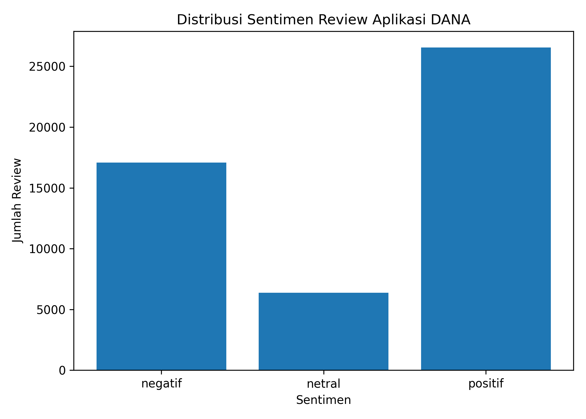
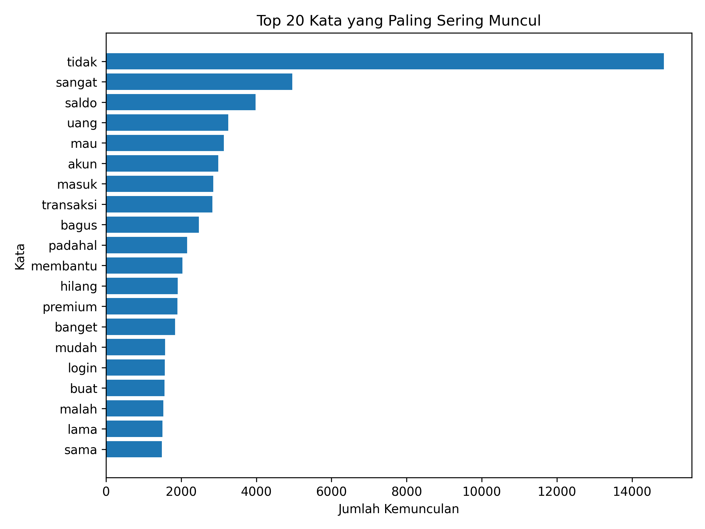
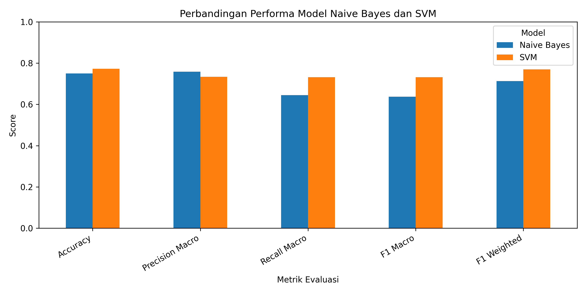
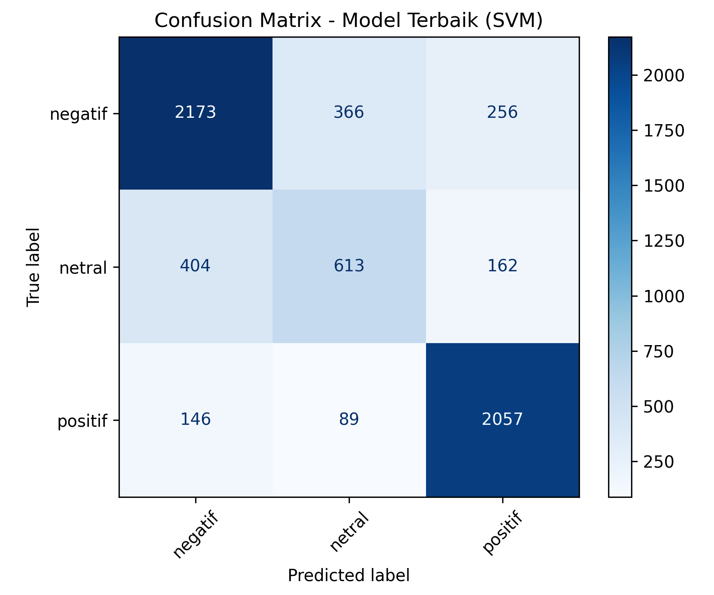

# Laporan Proyek Machine Learning - Analisis Sentimen Review Aplikasi DANA Menggunakan SVM dan Naive Bayes

## Project Overview


Perkembangan layanan dompet digital di Indonesia membuat aplikasi keuangan digital semakin banyak digunakan oleh masyarakat. Salah satu aplikasi dompet digital yang populer adalah **DANA**, yang menyediakan berbagai layanan seperti transfer uang, pembayaran tagihan, top up saldo, pembayaran QRIS, hingga transaksi online lainnya. Banyaknya pengguna aplikasi DANA membuat ulasan atau review pengguna di Google Play Store menjadi sumber informasi penting untuk mengetahui pengalaman pengguna terhadap aplikasi tersebut.

Review pengguna dapat berisi opini positif maupun negatif, misalnya terkait kemudahan penggunaan aplikasi, kecepatan transaksi, kendala login, saldo yang tertunda, proses upgrade akun, hingga pelayanan customer service. Oleh karena itu, analisis sentimen dapat digunakan untuk mengelompokkan review pengguna ke dalam kategori sentimen tertentu agar pola opini pengguna dapat lebih mudah dipahami.

Proyek ini bertujuan untuk membangun model machine learning yang mampu melakukan klasifikasi sentimen terhadap review aplikasi DANA menggunakan dua algoritma, yaitu **Support Vector Machine (SVM)** dan **Naive Bayes**. Kedua algoritma tersebut dibandingkan untuk mengetahui model mana yang memberikan performa terbaik dalam mengklasifikasikan sentimen review pengguna.

💡 **Manfaat Proyek:**

✔ Membantu memahami persepsi pengguna terhadap aplikasi DANA berdasarkan review.

✔ Mengidentifikasi kata-kata atau topik yang sering muncul dalam review pengguna.

✔ Membandingkan performa algoritma SVM dan Naive Bayes dalam klasifikasi sentimen.

✔ Menghasilkan model machine learning yang dapat digunakan untuk memprediksi sentimen dari review baru.

---

## Business Understanding

### 📝 Problem Statements

Berdasarkan latar belakang tersebut, rumusan masalah dalam proyek ini adalah:

* Bagaimana cara mengolah data review aplikasi DANA agar dapat digunakan dalam model klasifikasi sentimen?
* Bagaimana performa algoritma **Naive Bayes** dalam mengklasifikasikan sentimen review aplikasi DANA?
* Bagaimana performa algoritma **Support Vector Machine (SVM)** dalam mengklasifikasikan sentimen review aplikasi DANA?
* Algoritma mana yang memberikan hasil klasifikasi terbaik berdasarkan metrik evaluasi?

### 🎯 Goals

Tujuan dari proyek ini adalah:

* Melakukan preprocessing data teks review aplikasi DANA.
* Mengubah data teks menjadi bentuk numerik menggunakan metode **TF-IDF Vectorizer**.
* Membangun model klasifikasi sentimen menggunakan **Naive Bayes**.
* Membangun model klasifikasi sentimen menggunakan **Support Vector Machine (SVM)**.
* Membandingkan performa kedua model berdasarkan accuracy, precision, recall, dan F1-score.
* Membuat file deployment sederhana menggunakan Streamlit agar model dapat digunakan untuk memprediksi sentimen review baru.

### 🛠 Solution Approach

Pendekatan solusi yang digunakan dalam proyek ini adalah:

✔ **Text Preprocessing**
Membersihkan teks review dengan case folding, menghapus simbol, angka, tanda baca, link, stopwords, serta melakukan stemming.

✔ **TF-IDF Vectorization**
Mengubah teks hasil preprocessing menjadi representasi numerik agar dapat diproses oleh algoritma machine learning.

✔ **Naive Bayes**
Digunakan sebagai model klasifikasi berbasis probabilitas yang sering digunakan untuk data teks.

✔ **Support Vector Machine (SVM)**
Digunakan sebagai model klasifikasi yang mampu memisahkan data berdasarkan hyperplane terbaik.

✔ **Evaluasi Model**
Model dievaluasi menggunakan accuracy, precision, recall, F1-score, dan confusion matrix.

---

## Data Understanding

Dataset yang digunakan dalam proyek ini diperoleh dari Kaggle dengan nama dataset:

**DANA App Sentiment Review on Playstore Indonesia**

Dataset diunduh menggunakan library `kagglehub` dengan kode berikut:

```python
import kagglehub

path = kagglehub.dataset_download(
    "alexmariosimanjuntak/dana-app-sentiment-review-on-playstore-indonesia"
)

print("Path to dataset files:", path)
```

Dataset ini berisi review pengguna aplikasi DANA yang berasal dari Google Play Store. Data tersebut digunakan untuk membangun model klasifikasi sentimen berdasarkan isi ulasan pengguna.

### 📂 Informasi Dataset

| Komponen        | Keterangan           |
| --------------- | -------------------- |
| Sumber Dataset  | Kaggle               |
| Objek Data      | Review aplikasi DANA |
| Jenis Data      | Teks                 |
| Target          | Sentimen review      |
| Metode Analisis | Klasifikasi sentimen |
| Algoritma       | Naive Bayes dan SVM  |

### 📌 Uraian Fitur

Beberapa fitur utama yang digunakan dalam proyek ini adalah:

| Fitur           | Keterangan                                               |
| --------------- | -------------------------------------------------------- |
| Review/Content  | Isi ulasan atau komentar pengguna terhadap aplikasi DANA |
| Sentiment/Label | Kategori sentimen dari review pengguna                   |
| Clean Text      | Teks review yang telah melalui proses preprocessing      |

Nama kolom dapat disesuaikan dengan dataset yang terbaca pada notebook. Pada proyek ini, kolom teks digunakan sebagai variabel input, sedangkan kolom sentimen digunakan sebagai variabel target.

### 🔍 Kondisi Data

Pada tahap data understanding, dilakukan pengecekan awal terhadap dataset untuk mengetahui struktur dan kualitas data.

Langkah pengecekan data:

```python
df.head()
df.info()
df.shape
df.isnull().sum()
df.duplicated().sum()
df.columns
```

Pengecekan ini dilakukan untuk mengetahui:

✔ Jumlah data dalam dataset.

✔ Nama kolom yang tersedia.

✔ Jumlah missing value.

✔ Jumlah data duplikat.

✔ Distribusi kelas sentimen.

### 📊 Distribusi Sentimen



Berdasarkan visualisasi distribusi sentimen, dapat diketahui jumlah data pada masing-masing kelas sentimen. Visualisasi ini penting untuk melihat apakah dataset memiliki distribusi kelas yang seimbang atau tidak. Jika salah satu kelas terlalu dominan, maka model berpotensi lebih mudah memprediksi kelas mayoritas dibandingkan kelas lainnya.

### 📊 Top 20 Kata yang Sering Muncul



Visualisasi top 20 kata digunakan untuk mengetahui kata-kata yang paling sering muncul dalam review aplikasi DANA. Berdasarkan hasil visualisasi, beberapa kata yang sering muncul berkaitan dengan penggunaan aplikasi dompet digital, seperti **saldo**, **uang**, **akun**, **transaksi**, **masuk**, dan kata-kata lain yang menggambarkan pengalaman pengguna saat menggunakan aplikasi.

---

## Data Preparation

Tahap data preparation dilakukan untuk membersihkan dan mempersiapkan data sebelum digunakan dalam proses pemodelan. Karena data yang digunakan berbentuk teks, maka preprocessing menjadi tahapan penting agar model dapat memahami pola dalam review pengguna.

### 📌 1. Menghapus Missing Value dan Duplikat

Langkah pertama adalah menghapus data kosong dan data duplikat agar model tidak dilatih menggunakan data yang tidak valid atau berulang.

```python
df = df.dropna()
df = df.drop_duplicates()
```

Tujuan dari proses ini adalah:

✔ Menghindari error saat proses pelatihan model.

✔ Mengurangi bias akibat review yang berulang.

✔ Meningkatkan kualitas data yang digunakan.

### 📌 2. Case Folding

Case folding dilakukan untuk mengubah seluruh huruf menjadi huruf kecil.

Contoh:

| Sebelum             | Sesudah             |
| ------------------- | ------------------- |
| Aplikasi DANA Bagus | aplikasi dana bagus |

Proses ini dilakukan agar kata yang sama tidak dianggap berbeda hanya karena perbedaan huruf kapital.

```python
text = text.lower()
```

### 📌 3. Cleaning Text

Cleaning text dilakukan untuk menghapus elemen-elemen yang tidak diperlukan dalam teks, seperti link, angka, tanda baca, simbol, emoji, dan karakter khusus.

```python
import re

def clean_text(text):
    text = str(text).lower()
    text = re.sub(r'http\S+|www\S+', '', text)
    text = re.sub(r'[^a-zA-Z\s]', '', text)
    text = re.sub(r'\s+', ' ', text).strip()
    return text
```

Tujuan cleaning text adalah agar data menjadi lebih bersih dan hanya menyisakan kata-kata yang relevan untuk analisis sentimen.

### 📌 4. Stopword Removal

Stopword removal dilakukan untuk menghapus kata-kata umum yang tidak terlalu berpengaruh terhadap sentimen, seperti “yang”, “dan”, “di”, “ke”, “ini”, dan “itu”.

```python
def remove_stopwords(text):
    return ' '.join([word for word in text.split() if word not in stopwords_indonesia])
```

Tahapan ini membantu model lebih fokus pada kata-kata yang memiliki makna penting dalam review.

### 📌 5. Stemming

Stemming dilakukan untuk mengubah kata berimbuhan menjadi bentuk dasar.

Contoh:

| Sebelum     | Sesudah   |
| ----------- | --------- |
| menggunakan | guna      |
| pembayaran  | bayar     |
| transaksi   | transaksi |

```python
from Sastrawi.Stemmer.StemmerFactory import StemmerFactory

factory = StemmerFactory()
stemmer = factory.create_stemmer()

df['clean_text'] = df['clean_text'].apply(lambda x: stemmer.stem(x))
```

Stemming dilakukan agar variasi kata dengan makna yang sama dapat dianggap sebagai satu bentuk kata dasar.

### 📌 6. Train-Test Split

Dataset dibagi menjadi data latih dan data uji. Data latih digunakan untuk melatih model, sedangkan data uji digunakan untuk mengevaluasi performa model.

```python
from sklearn.model_selection import train_test_split

X = df['clean_text']
y = df['sentiment']

X_train, X_test, y_train, y_test = train_test_split(
    X, y,
    test_size=0.2,
    random_state=42,
    stratify=y
)
```

Rasio pembagian data yang digunakan adalah **80:20**, yaitu 80% data untuk training dan 20% data untuk testing.

### 📌 7. TF-IDF Vectorization

Model machine learning tidak dapat membaca teks secara langsung. Oleh karena itu, teks perlu diubah menjadi bentuk numerik menggunakan **TF-IDF Vectorizer**.

```python
from sklearn.feature_extraction.text import TfidfVectorizer

tfidf = TfidfVectorizer(max_features=5000)

X_train_tfidf = tfidf.fit_transform(X_train)
X_test_tfidf = tfidf.transform(X_test)
```

TF-IDF digunakan untuk memberikan bobot pada kata berdasarkan seberapa penting kata tersebut dalam dokumen. Kata yang sering muncul dalam satu dokumen tetapi tidak terlalu sering muncul di seluruh dokumen akan memiliki bobot yang lebih tinggi.

### 🔹 Kesimpulan Data Preparation

Tahapan data preparation berhasil menyiapkan data teks menjadi format yang dapat digunakan oleh model machine learning. Proses yang dilakukan meliputi pembersihan data, case folding, cleaning text, stopword removal, stemming, pembagian data, dan transformasi teks menggunakan TF-IDF.

---

## Modeling and Results

Pada tahap modeling, digunakan dua algoritma machine learning, yaitu **Naive Bayes** dan **Support Vector Machine (SVM)**. Kedua model dilatih menggunakan data hasil TF-IDF.

### 1. Naive Bayes

Naive Bayes merupakan algoritma klasifikasi berbasis probabilitas. Algoritma ini sering digunakan dalam klasifikasi teks karena sederhana, cepat, dan cukup efektif untuk data berbentuk kata atau dokumen.

```python
from sklearn.naive_bayes import MultinomialNB

nb_model = MultinomialNB()
nb_model.fit(X_train_tfidf, y_train)

y_pred_nb = nb_model.predict(X_test_tfidf)
```

🔹 **Kelebihan Naive Bayes:**

✔ Proses training cepat.

✔ Cocok untuk data teks.

✔ Tidak membutuhkan komputasi yang terlalu berat.

🔹 **Kekurangan Naive Bayes:**

✔ Mengasumsikan setiap fitur bersifat independen.

✔ Performa dapat menurun jika hubungan antar kata cukup kompleks.

### 2. Support Vector Machine (SVM)

Support Vector Machine adalah algoritma klasifikasi yang bekerja dengan mencari hyperplane terbaik untuk memisahkan data ke dalam kelas yang berbeda. Pada proyek ini digunakan **Linear SVM** karena data teks hasil TF-IDF biasanya memiliki dimensi fitur yang tinggi.

```python
from sklearn.svm import LinearSVC

svm_model = LinearSVC()
svm_model.fit(X_train_tfidf, y_train)

y_pred_svm = svm_model.predict(X_test_tfidf)
```

🔹 **Kelebihan SVM:**

✔ Cocok untuk data berdimensi tinggi seperti teks.

✔ Mampu menghasilkan performa yang baik pada klasifikasi sentimen.

✔ Efektif dalam memisahkan kelas menggunakan hyperplane.

🔹 **Kekurangan SVM:**

✔ Waktu pelatihan dapat lebih lama dibandingkan Naive Bayes.

✔ Perlu penyesuaian parameter jika ingin performa lebih optimal.

### 📊 Perbandingan Model



Berdasarkan hasil perbandingan model, performa Naive Bayes dan SVM dibandingkan menggunakan metrik evaluasi seperti accuracy, precision, recall, dan F1-score. Visualisasi ini digunakan untuk melihat model mana yang memiliki hasil klasifikasi terbaik.

---

## Evaluation Model

Evaluasi model dilakukan untuk mengetahui seberapa baik model dalam mengklasifikasikan sentimen review aplikasi DANA. Metrik evaluasi yang digunakan adalah **accuracy**, **precision**, **recall**, **F1-score**, dan **confusion matrix**.

### 📌 1. Accuracy

Accuracy menunjukkan persentase prediksi yang benar dari seluruh data uji.

```python
from sklearn.metrics import accuracy_score

accuracy_score(y_test, y_pred_nb)
accuracy_score(y_test, y_pred_svm)
```

Accuracy digunakan untuk melihat performa model secara umum. Namun, jika distribusi kelas tidak seimbang, accuracy saja tidak cukup sehingga perlu melihat precision, recall, dan F1-score.

### 📌 2. Precision

Precision menunjukkan seberapa tepat model dalam memprediksi suatu kelas sentimen. Nilai precision yang tinggi menunjukkan bahwa prediksi model pada kelas tertentu cenderung benar.

### 📌 3. Recall

Recall menunjukkan kemampuan model dalam menemukan seluruh data yang seharusnya masuk ke dalam suatu kelas sentimen. Nilai recall yang tinggi menunjukkan bahwa model mampu mengenali banyak data aktual pada kelas tersebut.

### 📌 4. F1-Score

F1-score merupakan rata-rata harmonis antara precision dan recall. Metrik ini penting digunakan ketika ingin melihat keseimbangan antara ketepatan dan kemampuan model dalam menangkap data aktual.

### 📌 5. Confusion Matrix



Confusion matrix digunakan untuk melihat jumlah prediksi benar dan salah pada setiap kelas. Dengan confusion matrix, dapat diketahui kelas sentimen mana yang paling sering diprediksi dengan benar dan kelas mana yang masih sering tertukar.

### 📊 Hasil Evaluasi Model

| Model       |                  Accuracy |                 Precision |                    Recall |                  F1-Score |
| ----------- | ------------------------: | ------------------------: | ------------------------: | ------------------------: |
| Naive Bayes | isi sesuai hasil notebook | isi sesuai hasil notebook | isi sesuai hasil notebook | isi sesuai hasil notebook |
| SVM         | isi sesuai hasil notebook | isi sesuai hasil notebook | isi sesuai hasil notebook | isi sesuai hasil notebook |

Berdasarkan hasil evaluasi, model dengan performa terbaik adalah **isi sesuai hasil notebook**. Model tersebut dipilih karena memiliki nilai accuracy dan F1-score yang lebih baik dibandingkan model lainnya.

### 🔹 Kesimpulan Evaluasi

Hasil evaluasi menunjukkan bahwa algoritma **SVM** dan **Naive Bayes** dapat digunakan untuk melakukan klasifikasi sentimen review aplikasi DANA. Jika model SVM memperoleh nilai evaluasi lebih tinggi, maka hal ini menunjukkan bahwa SVM lebih baik dalam memisahkan pola teks pada data review. Sebaliknya, jika Naive Bayes memperoleh nilai lebih tinggi, maka model tersebut lebih efektif untuk dataset ini karena mampu melakukan klasifikasi berbasis probabilitas dengan baik.

---

## Deployment

Tahap deployment dilakukan untuk membuat model dapat digunakan oleh pengguna dalam memprediksi sentimen dari review baru. Deployment dibuat menggunakan **Streamlit**.

File utama deployment adalah:

```text
app.py
```

File pendukung yang digunakan:

```text
requirements.txt
best_model.pkl
stopwords_indonesia.pkl
```

### Cara Menjalankan Aplikasi Secara Lokal

Untuk menjalankan aplikasi secara lokal, gunakan perintah berikut:

```bash
pip install -r requirements.txt
streamlit run app.py
```

Setelah perintah dijalankan, aplikasi akan terbuka di browser. Pengguna dapat memasukkan teks review, kemudian sistem akan menampilkan hasil prediksi sentimen berdasarkan model terbaik.

### Tampilan Input Aplikasi

Aplikasi menerima input berupa teks review pengguna. Contoh input:

```text
Aplikasi DANA sangat membantu untuk transaksi sehari-hari.
```

Contoh output:

```text
Sentimen: Positif
```

Contoh input lain:

```text
Saldo saya hilang dan transaksi gagal terus.
```

Contoh output:

```text
Sentimen: Negatif
```

### File yang Tersedia di Repository

Repository GitHub proyek ini memuat beberapa file utama:

| File                                                       | Keterangan                              |
| ---------------------------------------------------------- | --------------------------------------- |
| README.md                                                  | Laporan akhir proyek                    |
| app.py                                                     | File deployment Streamlit               |
| requirements.txt                                           | Daftar library yang dibutuhkan          |
| best_model.pkl                                             | Model terbaik hasil training            |
| hasil_evaluasi.pkl                                         | Hasil evaluasi model                    |
| stopwords_indonesia.pkl                                    | File stopwords Bahasa Indonesia         |
| 01_distribusi_sentimen.png                                 | Visualisasi distribusi sentimen         |
| 02_top_20_kata.png                                         | Visualisasi kata yang sering muncul     |
| 03_perbandingan_model.png                                  | Visualisasi perbandingan performa model |
| 04_confusion_matrix_model_terbaik.png                      | Confusion matrix model terbaik          |
| Analisis_Sentimen_DANA_SVM_Naive_Bayes_CRISPDM_Colab.ipynb | Notebook utama proyek                   |

---

## Kesimpulan

Berdasarkan proyek analisis sentimen review aplikasi DANA, dapat disimpulkan bahwa:

⭐ Data review pengguna dapat digunakan untuk memahami opini pengguna terhadap aplikasi DANA.

⭐ Tahapan preprocessing teks sangat penting karena data review masih mengandung kata tidak baku, tanda baca, simbol, angka, dan kata umum yang perlu dibersihkan.

⭐ TF-IDF berhasil mengubah data teks menjadi representasi numerik sehingga dapat digunakan oleh model machine learning.

⭐ Algoritma Naive Bayes dan SVM dapat digunakan untuk klasifikasi sentimen review aplikasi DANA.

⭐ Model terbaik ditentukan berdasarkan hasil evaluasi menggunakan accuracy, precision, recall, F1-score, dan confusion matrix.

⭐ Deployment menggunakan Streamlit memungkinkan model digunakan untuk memprediksi sentimen review baru secara sederhana.

Secara keseluruhan, proyek ini menunjukkan bahwa machine learning dapat membantu mengklasifikasikan opini pengguna aplikasi DANA secara otomatis. Hasil analisis ini dapat dikembangkan lebih lanjut dengan menambahkan jumlah data, melakukan hyperparameter tuning, atau mencoba algoritma lain seperti Random Forest, Logistic Regression, atau deep learning untuk meningkatkan performa model.
